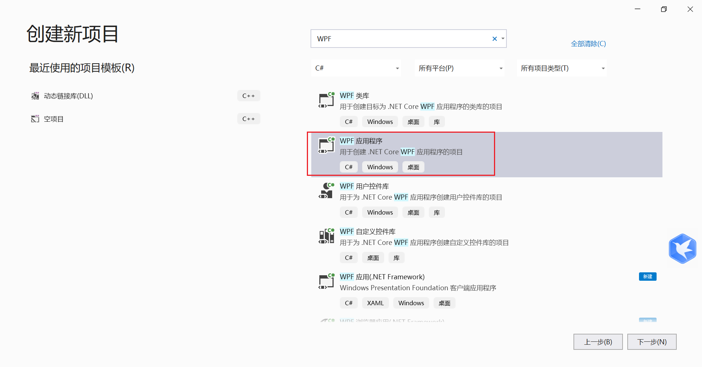
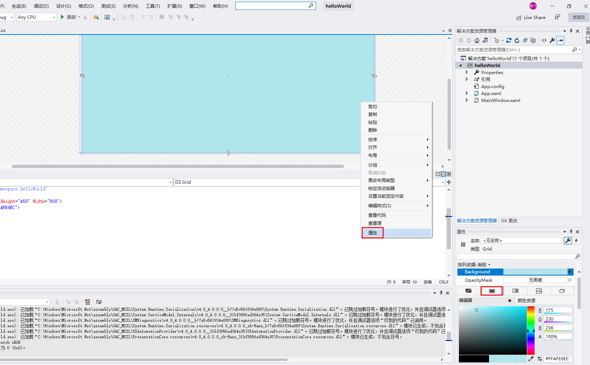
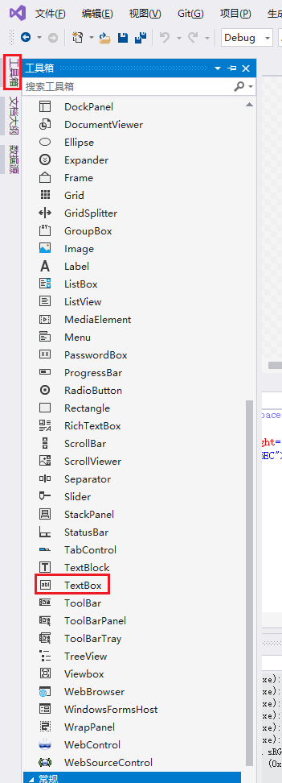
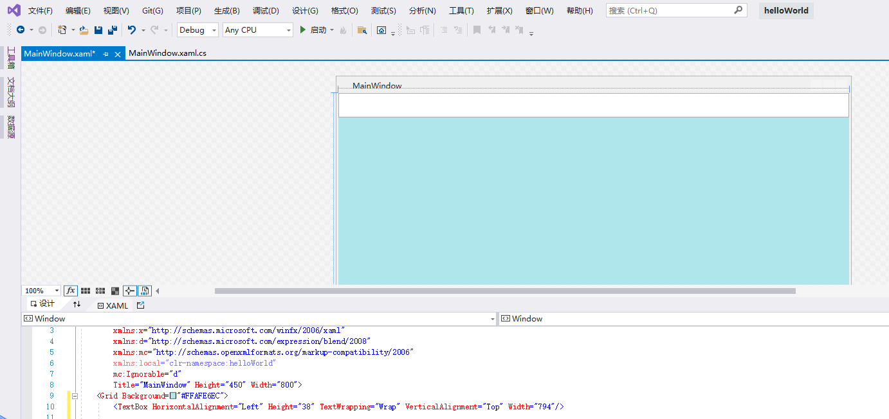
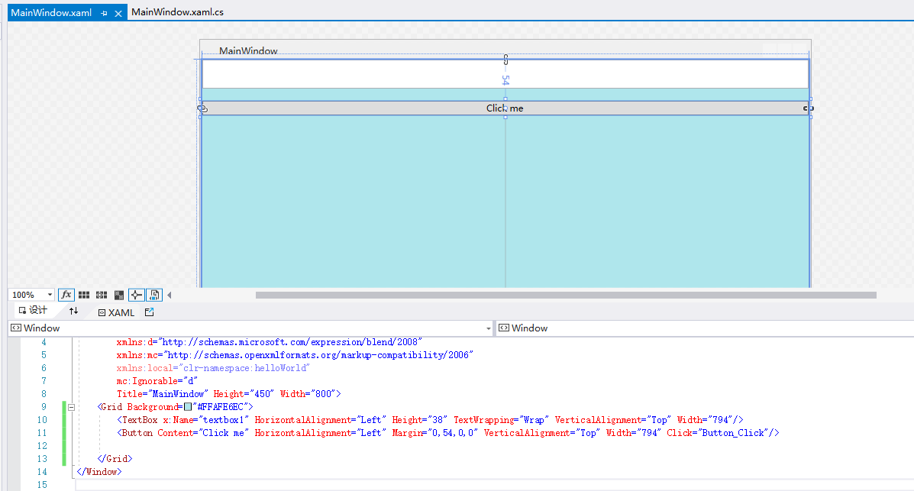
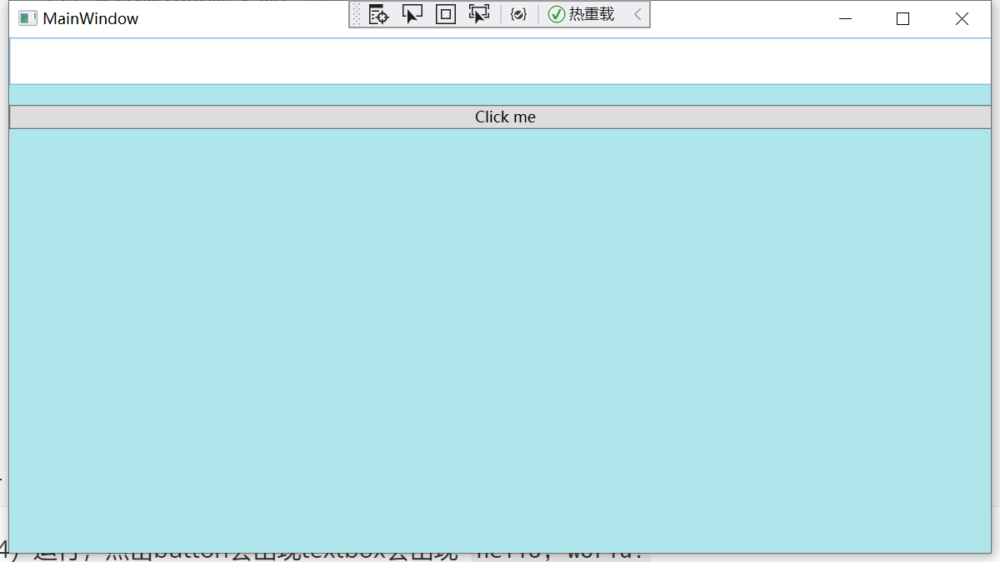
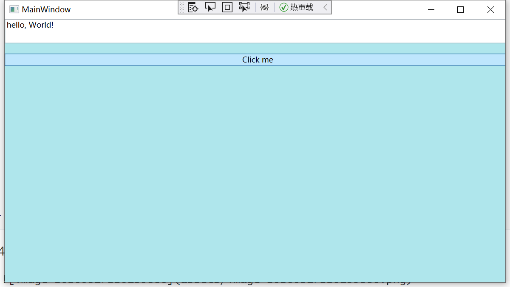
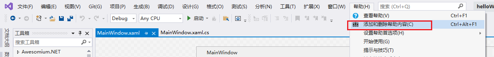
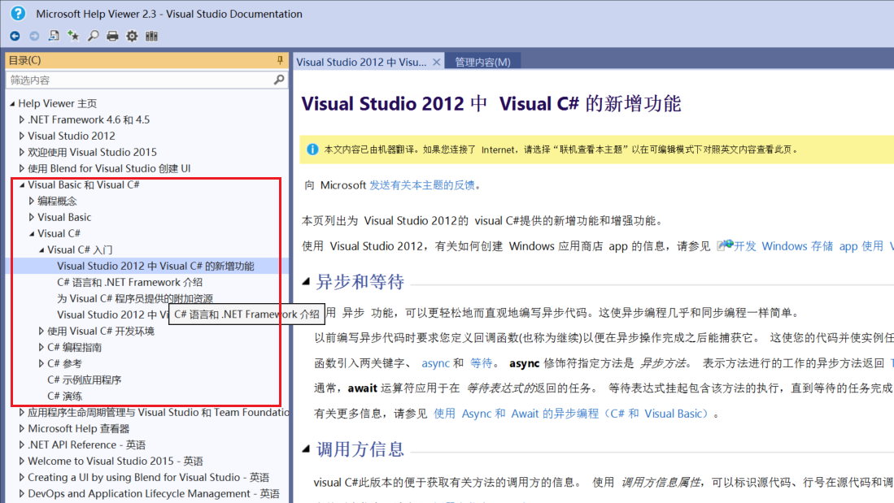

# C#语言入门

视频：https://www.bilibili.com/video/BV13b411b7Ht/

## 001.C#语言简介

### 1.怎样编写程序和程序语言的选择

- 编辑——>编译——>调试——>发布

编程的学习路径
- 纵向：语言——>类库——>框架
- 横向：命令行程序，桌面程序，设备（平板/手机）程序，Web（网站/服务）程序，游戏.....


### 2.使用visual studio创建WPF项目-Helloworld

[helloworld项目](./projects/project001/helloWorld)



（1）设置背景色



（2）添加文本框



拖进窗口中后



给这个TextBox对象添加一个名字，这个脚本看着像前端的

```xaml
<Window x:Class="helloWorld.MainWindow"
        xmlns="http://schemas.microsoft.com/winfx/2006/xaml/presentation"
        xmlns:x="http://schemas.microsoft.com/winfx/2006/xaml"
        xmlns:d="http://schemas.microsoft.com/expression/blend/2008"
        xmlns:mc="http://schemas.openxmlformats.org/markup-compatibility/2006"
        xmlns:local="clr-namespace:helloWorld"
        mc:Ignorable="d"
        Title="MainWindow" Height="450" Width="800">
    <Grid Background="#FFAFE6EC">
        <TextBox x:Name="textbox1" HorizontalAlignment="Left" Height="38" TextWrapping="Wrap" VerticalAlignment="Top" Width="794"/>
    </Grid>
</Window>
```

（3）添加button



```c#
namespace helloWorld
{
    /// <summary>
    /// MainWindow.xaml 的交互逻辑
    /// </summary>
    public partial class MainWindow : Window
    {
        public MainWindow()
        {
            InitializeComponent();
        }

        private void Button_Click(object sender, RoutedEventArgs e)
        {
            this.textbox1.Text = "hello, World!"; // 新增
        }
    }
}
```

（4）运行，点击button会出现textbox会出现`hello, World!`



点击后：



### 3.学习手册

[C# language specification](https://learn.microsoft.com/en-us/dotnet/csharp/language-reference/language-specification/introduction)

visual studio中的手册文档：






## 002.初识各类应用程序

### 1.编程学习的捷径

- 编程式**练**出来的
- 在反复应用中积累，忽然有一天就会顿悟
- 学习原则
  - 从感官到原理
  - 从使用别人的到创建自己的
  - 必须亲自动手
  - 必须学以致用、紧跟实际工作
  - 追求使用，不搞“学院派”

### 2.第一个程序：Hello，World！

#### 2.1常识

- Solution与Project
  - Solution是针对客户需求的总的解决方案。举例：汽车经销商需要一套销售软件
  - project解决具体的某个问题
- Project模板（对比不同VS版本）
- 分别编写Console、WPF、Windows Forms的Hello World程序

#### 2.2 见识C#编写的各类应用程序

- Console
- **WPF（Windows Presentation Foundation）**
- Windows Forms（Old）
- ASP.NET Web Forms（Old）
- **SAP.NET MVC（Model-View-Controller）**
- **WCF（Windows Communication Foundation）**
- **Windows Store Application**
- **Windows Phone Application**
- **Cloud（Windows Azure）**
- WF（Workflow Foundation）

#### 2.3


